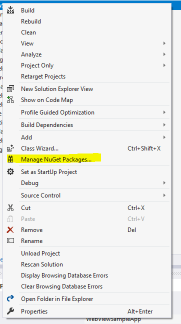
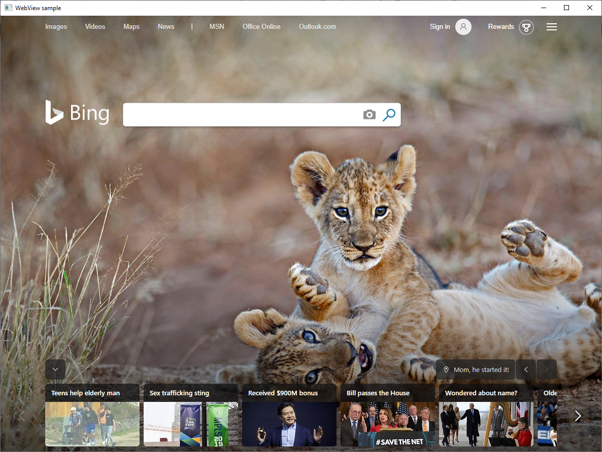

# Mise en route de WebView2 (developer preview)

Cette procédure pas à pas décrit les fonctionnalités couramment utilisées de [WebView2 (developer preview)](https://aka.ms/webview) et vous permet de commencer à créer votre première application WebView2. Pour en savoir plus sur les API individuelles, voir informations de référence sur les [API](../reference/win32/0-9-488-reference-webview2.md) .  

## Conditions préalables

* [Microsoft Edge (chrome)](https://www.microsoftedgeinsider.com/download/) installé sur un système d’exploitation pris en charge (actuellement Windows 10, Windows 8,1 et Windows 7). **Nous vous recommandons d’utiliser le canal des Canaries et la version minimale requise est 82.0.488.0**.
* [Visual Studio](https://visualstudio.microsoft.com/) 2015 ou version ultérieure avec prise en charge C++ installée.

## Étape 1: créer une application Win32 de fenêtre unique

Nous allons commencer par un projet de bureau de base contenant une seule fenêtre principale. Comme il ne s’agit pas du principal objectif de cette procédure pas à pas, nous allons utiliser un exemple de code modifié de la [procédure pas à pas: création d’une application de bureau Windows classique (C++)](/cpp/windows/walkthrough-creating-windows-desktop-applications-cpp?view=vs-2019). [Téléchargez](https://aka.ms/HelloWebView) l’exemple modifié pour commencer.

Ouvrez **WebView2GettingStarted. sln** dans Visual Studio. Si vous utilisez une ancienne version de Visual Studio, cliquez avec le bouton droit sur le projet **WebView2GettingStarted** , puis cliquez sur **Propriétés**. Sous **Propriétés de configuration**  >  **générales**, modifiez la version et l' **ensemble d’outils de plateforme** du **SDK Windows** pour utiliser le kit de développement logiciel (SDK) Win10 et l’ensemble d’outils vs disponibles.


Visual Studio peut afficher des erreurs en raison d’un fichier d’en-tête WebView2 manquant, qui doit être placé une fois l’étape 2 terminée.

## Étape 2: installer le SDK WebView2

À présent, nous allons ajouter le kit de développement logiciel (SDK) WebView2 au projet. Pour la version préliminaire du développeur, vous pouvez installer le kit de développement logiciel (SDK) Win32 via NuGet.

1. Cliquez avec le bouton droit sur le projet, puis cliquez sur **gérer les packages NuGet**.

    

2. Entrez **Microsoft. Windows. ImplementationLibrary** dans la barre de recherche, cliquez sur **Microsoft. Windows. ImplementationLibrary** à partir des résultats, puis cliquez sur **installer** dans la fenêtre de droite, puis installez le SDK le plus récent. NuGet télécharge le SDK sur votre ordinateur. Bien que nous ayons recours à la [bibliothèque d’implémentation Windows](https://github.com/Microsoft/wil) et à la [bibliothèque de modèles C++ Windows Runtime](/cpp/cppcx/wrl/windows-runtime-cpp-template-library-wrl?view=vs-2019) pour faciliter l’utilisation de com dans le cadre de cette procédure pas à pas, ces dernières sont entièrement facultatives.

    

3. Entrez **Microsoft. Web. WebView2** dans la barre de recherche, cliquez sur **Microsoft. Web. WebView2** à partir des résultats, puis cliquez sur **installer** dans la fenêtre de droite, puis installez le SDK le plus récent. NuGet télécharge le SDK sur votre ordinateur.

    

4. Incluez l’en-tête WebView2. Dans **HelloWebView. cpp**, ajoutez `#include "WebView2.h"` sous les lignes de `#include` s.

    ```cpp
    ...
    #include <wrl.h>
    #include <wil/com.h>
    // include WebView2 header
    #include "WebView2.h"
    ```

Vous êtes prêt à utiliser l’API WebView2 et à la générer. Appuyez sur la touche F5 pour générer et exécuter l’exemple d’application. Une application doit afficher une fenêtre vide.


## Étape 3: créer un WebView unique dans la fenêtre parent

Ajoutons maintenant un WebView à la fenêtre principale. Nous allons utiliser `CreateCoreWebView2Environment` pour configurer l’environnement et rechercher le navigateur Microsoft Edge (chrome) qui alimente le contrôle. Vous pouvez également utiliser `CreateCoreWebView2EnvironmentWithOptions` si vous voulez spécifier l’emplacement du navigateur, le dossier utilisateur, les indicateurs du navigateur, etc., au lieu d’utiliser le paramètre par défaut. Lorsque `CreateCoreWebView2Environment` vous aurez terminé, vous serez en mesure d’appeler `ICoreWebView2Environment::CreateCoreWebView2Controller` le `ICoreWebView2CreateCoreWebView2EnvironmentCompletedHandler` rappel et d’appeler `ICoreWebView2Controller::get_CoreWebView2` pour obtenir le WebView associé.

Dans le rappel, définissons également quelques paramètres, redimensionnez le WebView de sorte qu’il prenne 100% de la fenêtre parente, et naviguez jusqu’à Bing.

Copiez le code suivant dans **HelloWebView. cpp** entre `// <-- WebView2 sample code starts here -->` et `// <-- WebView2 sample code ends here -->` .

```cpp
// Step 3 - Create a single WebView within the parent window
// Locate the browser and set up the environment for WebView
CreateCoreWebView2EnvironmentWithOptions(nullptr, nullptr, nullptr,
    Callback<ICoreWebView2CreateCoreWebView2EnvironmentCompletedHandler>(
        [hWnd](HRESULT result, ICoreWebView2Environment* env) -> HRESULT {

            // Create a CoreWebView2Controller and get the associated CoreWebView2 whose parent is the main window hWnd
            env->CreateCoreWebView2Controller(hWnd, Callback<ICoreWebView2CreateCoreWebView2ControllerCompletedHandler>(
                [hWnd](HRESULT result, ICoreWebView2Controller* controller) -> HRESULT {
                if (controller != nullptr) {
                    webviewController = controller;
                    webviewController->get_CoreWebView2(&webviewWindow);
                }

                // Add a few settings for the webview
                // this is a redundant demo step as they are the default settings values
                ICoreWebView2Settings* Settings;
                webviewWindow->get_Settings(&Settings);
                Settings->put_IsScriptEnabled(TRUE);
                Settings->put_AreDefaultScriptDialogsEnabled(TRUE);
                Settings->put_IsWebMessageEnabled(TRUE);

                // Resize WebView to fit the bounds of the parent window
                RECT bounds;
                GetClientRect(hWnd, &bounds);
                webviewController->put_Bounds(bounds);

                // Schedule an async task to navigate to Bing
                webviewWindow->Navigate(L"https://www.bing.com/");

                // Step 4 - Navigation events


                // Step 5 - Scripting


                // Step 6 - Communication between host and web content


                return S_OK;
            }).Get());
        return S_OK;
    }).Get());
```

Appuyez sur la touche F5 pour générer et exécuter l’application. Maintenant, vous disposez d’une fenêtre WebView qui affiche Bing.



## Étape 4: événements de navigation

Nous avons déjà parlé à l’adresse URL en utilisant `ICoreWebView2::Navigate` la dernière étape. Pendant la navigation, WebView déclenche une séquence d’événements que l’hôte peut écouter,,,, `NavigationStarting` `SourceChanged` `ContentLoading` `HistoryChanged` et `NavigationCompleted` . Pour en savoir plus, cliquez [ici](../reference/win32/0-9-488/ICoreWebView2.md#navigation-events) .


Dans les cas d’erreur, il est possible, ou non `SourceChanged` , `ContentLoading` ou des `HistoryChanged` événements en fonction de la poursuite de la navigation sur une page d’erreur. Dans le cas d’une redirection HTTP, plusieurs événements sont présents `NavigationStarting` dans une ligne.

Pour savoir comment utiliser ces événements, nous allons enregistrer un gestionnaire pour `NavigationStarting` annuler toute demande non HTTPS. Copiez le code suivant dans **HelloWebView. cpp** ci-dessous `// Step 4 - Navigation events` .

```cpp
// register an ICoreWebView2NavigationStartingEventHandler to cancel any non-https navigation
EventRegistrationToken token;
webviewWindow->add_NavigationStarting(Callback<ICoreWebView2NavigationStartingEventHandler>(
    [](ICoreWebView2* webview, ICoreWebView2NavigationStartingEventArgs * args) -> HRESULT {
        PWSTR uri;
        args->get_Uri(&uri);
        std::wstring source(uri);
        if (source.substr(0, 5) != L"https") {
            args->put_Cancel(true);
        }
        CoTaskMemFree(uri);
        return S_OK;
    }).Get(), &token);
```

À présent, l’application n’accède à aucun site non HTTPS. Vous pouvez utiliser le même mécanisme pour effectuer d’autres tâches, comme limiter la navigation à l’intérieur de votre propre domaine.

## Étape 5: création de scripts

L’application d’hébergement peut également injecter JavaScript dans WebView. Vous pouvez Task WebView pour exécuter du code JavaScript arbitraire ou ajouter des scripts d’initialisation. Les scripts d’initialisation ajoutés s’appliquent à tous les futurs documents de niveau supérieur et navigation de cadre enfant jusqu’à leur suppression, puis exécutés après la création de l’objet global et avant l’exécution de tout autre script fourni par le document HTML.

Copiez le code suivant `// Step 5 - Scripting` .

```cpp
// Schedule an async task to add initialization script that freezes the Object object
webviewWindow->AddScriptToExecuteOnDocumentCreated(L"Object.freeze(Object);", nullptr);
// Schedule an async task to get the document URL
webviewWindow->ExecuteScript(L"window.document.URL;", Callback<ICoreWebView2ExecuteScriptCompletedHandler>(
    [](HRESULT errorCode, LPCWSTR resultObjectAsJson) -> HRESULT {
        LPCWSTR URL = resultObjectAsJson;
        //doSomethingWithURL(URL);
        return S_OK;
    }).Get());
```

Maintenant, WebView figera toujours l’objet objet et renverra le document page une seule fois.

**Notez que ces API d’injection de script (et d’autres API WebView2) sont asynchrones, vous devez utiliser des rappels si le code doit être exécuté dans un ordre particulier.**

## Étape 6: communication entre l’hôte et le contenu Web

L’hôte et le contenu Web peuvent également communiquer entre eux `postMessage` . Le contenu Web exécuté au sein d’un WebView peut être publié sur l’hôte `window.chrome.webview.postMessage` et le message est géré par tout inscrit `ICoreWebView2WebMessageReceivedEventHandler` sur l’hôte. De même, l’hôte peut afficher le contenu Web via `ICoreWebView2::PostWebMessageAsString` ou `ICoreWebView2::PostWebMessageAsJSON` , qui serait intercepté par des gestionnaires ajoutés `window.chrome.webview.addEventListener` . Le mécanisme de communication permet au contenu Web d’utiliser les fonctionnalités natives en passant des messages pour demander à l’hôte d’appeler des API natives.

Par exemple, pour comprendre le mécanisme, nous allons essayer d’imprimer l’URL du document dans WebView avec une petite présentation.

1. l’hôte inscrit un gestionnaire pour renvoyer le message reçu au contenu Web.
2. l’hôte injecte un script dans le contenu Web qui inscrit un gestionnaire pour imprimer le message à partir de l’hôte.
3. l’hôte injecte un script dans le contenu Web qui publie l’URL sur l’hôte.
4. le gestionnaire de l’hôte est déclenché et renvoie le message (URL) du contenu Web.
5. le gestionnaire du contenu Web est déclenché et imprime le message de l’hôte (URL)

Copiez le code suivant `// Step 6 - Communication between host and web content` ,

```cpp
// Set an event handler for the host to return received message back to the web content
webviewWindow->add_WebMessageReceived(Callback<ICoreWebView2WebMessageReceivedEventHandler>(
    [](ICoreWebView2* webview, ICoreWebView2WebMessageReceivedEventArgs * args) -> HRESULT {
        PWSTR message;
        args->TryGetWebMessageAsString(&message);
        // processMessage(&message);
        webview->PostWebMessageAsString(message);
        CoTaskMemFree(message);
        return S_OK;
    }).Get(), &token);

// Schedule an async task to add initialization script that
// 1) Add an listener to print message from the host
// 2) Post document URL to the host
webviewWindow->AddScriptToExecuteOnDocumentCreated(
    L"window.chrome.webview.addEventListener(\'message\', event => alert(event.data));" \
    L"window.chrome.webview.postMessage(window.document.URL);",
nullptr);
```

Appuyez sur la touche F5 pour générer et exécuter l’application. Le message URL s’affiche alors avant de naviguer vers les pages.


Félicitations, vous venez de créer votre première application WebView2.

## Étapes suivantes

Il existe de nombreuses fonctionnalités WebView2 non traitées dans cette procédure pas à pas.

Pour en savoir plus:

* Consultez l' [exemple d’API WebView2](https://github.com/MicrosoftEdge/WebView2Samples/tree/master/WebView2APISample) pour obtenir un exemple complet de fonctionnalités WebView2's.
* Extraire [WebView2Browser](https://github.com/MicrosoftEdge/WebView2Browser) une application créée à l’aide de WebView2.
* Pour plus d’informations sur notre API, consultez les informations de référence sur les [API](../reference/win32/0-9-488-reference-webview2.md) .  

## Contacter l’équipe WebView2  

Aidez-nous à créer une expérience WebView2 plus riche en partageant vos commentaires! Consultez notre page de [Commentaires référentiel Samples](https://aka.ms/webviewfeedback) pour envoyer des demandes de fonctionnalité ou des rapports de bogues, ou pour rechercher des problèmes connus.
