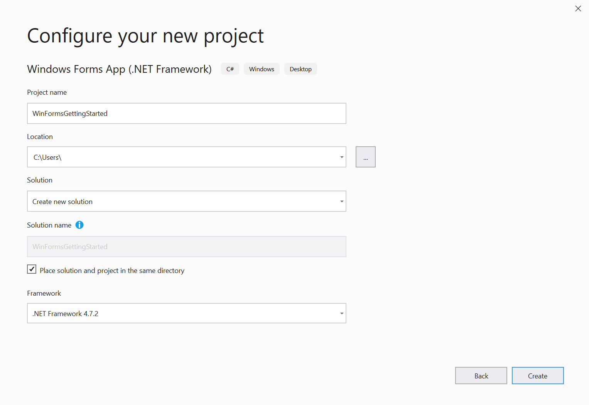
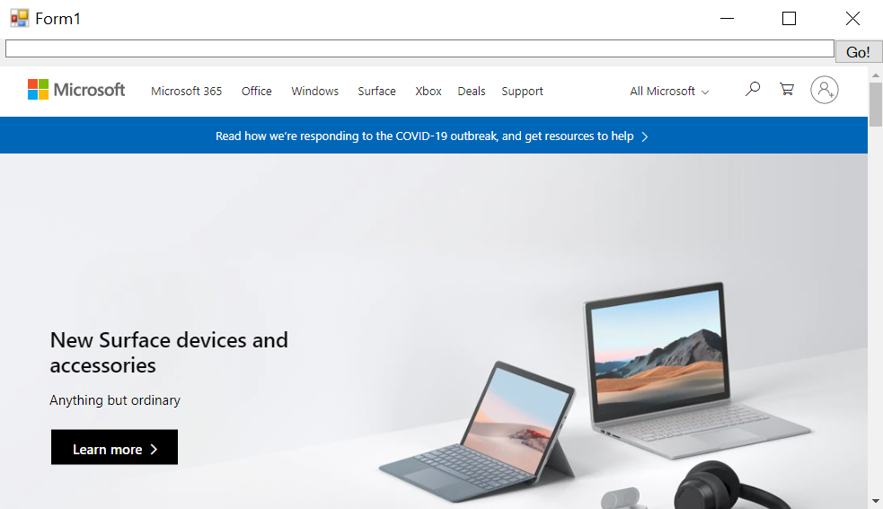

# Commencer à utiliser WebView2 dans les applications Windows Forms (Preview)  

Dans cet article, vous allez commencer à créer votre première application WebView2 et à découvrir les principales fonctionnalités de [WebView2 (Preview)](/microsoft-edge/hosting/webview2/index).  Pour plus d’informations sur les API individuelles, voir informations de référence sur les [API](../reference/dotnet/0-9-515-reference-webview2.md).  

## Conditions préalables  

Vérifiez que vous avez installé la liste des conditions préalables suivantes avant de continuer:  

* [Canal Canaries Microsoft Edge (chrome)](https://www.microsoftedgeinsider.com/download/) installé sur Windows 10, Windows 8,1 ou Windows 7. 
* [Visual Studio](https://visualstudio.microsoft.com/) 2017 ou version ultérieure.

> [!NOTE]
> Si vous développez avec **Windows Forms .net Core 3,0 ou .net 5**, téléchargez [Visual Studio (Preview)](https://visualstudio.microsoft.com/vs/preview/) .

## Étape 1: créer une application de fenêtre unique

Utiliser un projet de bureau de base contenant une seule fenêtre principale.  

1. Ouvrez **Visual Studio.**

2. Choisissez **application .NET Framework pour Windows Forms** ou **application .net pour Windows Forms**, puis cliquez sur **suivant**.

    

3. Entrez des valeurs pour le nom et l' **emplacement**du **projet** .  Sélectionnez **.NET Framework 4.6.2** ou version ultérieure, ou **.net Core 3,0** ou version ultérieure.  

    

4. Sélectionnez **créer** pour créer votre projet.

## Étape 2: installer le SDK WebView2

Ajoutez ensuite le kit de développement logiciel (SDK) WebView2 au projet.  Pour obtenir un aperçu, installez le kit de développement logiciel (SDK) WebView2 avec NuGet.  

1. Ouvrez le menu contextuel du projet \ (cliquez avec le bouton droit sur \) et sélectionnez **gérer les packages NuGet...**.  

    :::image type="complex" source="./media/wpf-gettingstarted-mngnuget.png" alt-text="NuGet":::
       NuGet :::image-end:::

2. Entrez `Microsoft.Web.WebView2` dans la barre de recherche.  Pour cela, sélectionnez **Microsoft. Web. WebView2** dans les résultats de recherche.  Définissez la version du package sur **Pre-Release**, puis sélectionnez **installer**.  

    

Vous êtes prêt à commencer à développer des applications à l’aide de l’API WebView2.  Sélectionnez `F5` pour générer et exécuter le projet.  Le projet en cours d’exécution affiche une fenêtre vide.  


## Étape 3: créer un WebView unique  

Ensuite, ajoutez un WebView à votre application.  

1. Ouvrez le **Concepteur Windows Forms**.  
2. Recherchez **WebView2** dans la **boîte à outils**. Faites glisser et déposez le contrôle **WebView2** dans l’application Windows Forms

    

3. Remplacez la `Name` propriété par `webView` .

    

4. La `Source` propriété définit l’URI initial affiché dans le contrôle WebView2. Définissez la propriété source sur <https://www.microsoft.com>

    

Sélectionnez `F5` pour générer et exécuter votre projet.  Vérifiez que votre contrôle WebView2 s’affiche [https://www.microsoft.com](https://www.microsoft.com) .


> [!NOTE]
> Si vous travaillez sur un moniteur haute résolution, il est possible que vous deviez [configurer votre application Windows Forms pour la prise en charge des résolutions élevées](https://docs.microsoft.com/dotnet/framework/winforms/high-dpi-support-in-windows-forms#configuring-your-windows-forms-app-for-high-dpi-support).

## Étape 4: gérer les événements de redimensionnement de la fenêtre

Ajoutez quelques contrôles supplémentaires à vos formulaires Windows à partir de la boîte à outils, puis gérez les événements de redimensionnement de fenêtre de manière appropriée.

1. Dans le **Concepteur Windows Forms** , ouvrez la **boîte à outils**
2. Faites glisser et déposez un **contrôle TextBox** dans l’application Windows Forms. Nommez le **contrôle TextBox** `addressBar` dans l' **onglet Propriétés**.
3. Faites glisser et déposez un **bouton** dans l’application Windows Forms. Modifiez le texte du **bouton** `Go!` et nommez-le **Button** `goButton` dans l' **onglet Propriétés**.

Dans le concepteur, l’application doit ressembler à ce qui suit:


4. Dans **Form1.cs** , définissez `Form_Resize` l’emplacement des contrôles lorsque la fenêtre de l’application est redimensionnée.

```csharp
public Form1()
{
    InitializeComponent();
    this.Resize += new System.EventHandler(this.Form_Resize);
}

private void Form_Resize(object sender, EventArgs e)
{
    webView.Size = this.ClientSize - new System.Drawing.Size(webView.Location);
    goButton.Left = this.ClientSize.Width - goButton.Width;
    addressBar.Width = goButton.Left - addressBar.Left;
}
```

Sélectionnez `F5` pour générer et exécuter votre projet.  Vérifiez que l’application s’affiche comme dans la capture d’écran suivante.



## Étape 5: navigation

Ajoutez la possibilité d’autoriser les utilisateurs à modifier l’URL d’affichage du contrôle WebView2 en ajoutant une barre d’adresse à l’application.

1. Dans `Form1.cs` Ajouter l' `CoreWebView2` espace de noms en insérant l’extrait de code suivant en haut de `Form1.cs` .  

    ```csharp
    using Microsoft.Web.WebView2.Core;
    ```

2. Dans le **Concepteur Windows Forms**, double-cliquez sur le `Go!` bouton pour créer la `goButton_Click` méthode `Form1.cs` . Copiez et collez l’extrait de code suivant dans la fonction. À présent, la `goButton_Click` fonction navigue vers l’URL entrée dans la barre d’adresses de l’affichage.

    ```csharp
    private void goButton_Click(object sender, EventArgs e)
    {
        if (webView != null && webView.CoreWebView2 != null)
        {
            webView.CoreWebView2.Navigate(addressBar.Text);
        }
    }
    ```  

Sélectionnez `F5` pour générer et exécuter votre projet.  Entrez une nouvelle URL dans la barre d’adresses, puis cliquez sur **atteindre**.  Par exemple, entrez `https://www.bing.com` .  Vérifiez que le contrôle WebView2 accède à l’URL.  

> [!NOTE]
> Vérifiez qu’une URL complète est entrée dans la barre d’adresses. `ArgumentException`A est levé si l’URL ne commence pas par `http://` ou `https://`


## Étape 6: événements de navigation  

L’application qui héberge les contrôles WebView2 écoute les événements suivants qui sont déclenchés par le contrôle WebView2 lors de la navigation dans les pages Web.  

* `NavigationStarting`  
* `SourceChanged`  
* `ContentLoading`  
* `HistoryChanged`  
* `NavigationCompleted`  

Pour plus d’informations, voir [événements de navigation](../reference/win32/0-9-488/icorewebview2.md#navigation-events).  

:::image type="complex" source="../media/navigation-events.png" alt-text="Événements de navigation":::
   Événements de navigation
:::image-end:::

Lorsqu’une erreur se produit, les événements suivants sont déclenchés et peut dépendre de la navigation sur une page d’erreur.  

* `SourceChanged`  
* `ContentLoading`  
* `HistoryChanged`  

S’il existe une redirection HTTP, il existe plusieurs `NavigationStarting` événements.  

Pour illustrer l’utilisation de ces événements, commencez par enregistrer un gestionnaire pour `NavigationStarting` cela annule toutes les demandes qui n’utilisent pas HTTPS.  

Dans `Form1.cs` , modifiez le constructeur comme illustré ci-dessous, puis ajoutez la `EnsureHttps` fonction.  

```csharp
public Form1()
{
    InitializeComponent();
    this.Resize += new System.EventHandler(this.Form_Resize);

    webView.NavigationStarting += EnsureHttps;
}

void EnsureHttps(object sender, CoreWebView2NavigationStartingEventArgs args)
{
    String uri = args.Uri;
    if (!uri.StartsWith("https://"))
    {
        args.Cancel = true;
    }
}
```

Dans le constructeur, EnsureHttps est enregistré en tant que gestionnaire d’événements sur l' `NavigationStarting` événement sur le contrôle WebView2.  

Sélectionnez `F5` pour générer et exécuter votre projet. Confirmez que lorsque vous naviguez vers un site HTTP, le WebView reste inchangé. Toutefois, le WebView accède aux sites HTTPs.

## Étape 7: création de scripts  

Vous pouvez utiliser des applications hôtes pour injecter du code JavaScript dans les contrôles WebView2 lors de l’exécution.  Le JavaScript injecté s’applique à tous les nouveaux documents de niveau supérieur ainsi qu’à toute image enfant jusqu’à ce que le JavaScript soit supprimé.  Le JavaScript injecté est exécuté après la création de l’objet global et avant l’exécution de tout autre script inclus dans le document HTML.  

Vous pouvez utiliser les scripts pour alerter l’utilisateur lorsque vous naviguez vers un site non HTTPs.  Modifiez la `EnsureHttps` fonction de telle sorte qu’elle injecte le script dans le contenu Web à l’aide de la méthode [ExecuteScriptAsync]() .  

```csharp
void EnsureHttps(object sender, CoreWebView2NavigationStartingEventArgs args)
{
    String uri = args.Uri;
    if (!uri.StartsWith("https://"))
    {
        webView.CoreWebView2.ExecuteScriptAsync($"alert('{uri} is not safe, try an https link')");
        args.Cancel = true;
    }
}
```  

Sélectionnez `F5` pour générer et exécuter votre projet.  Vérifiez que l’application affiche une alerte lorsque vous naviguez vers un site qui n’utilise pas HTTPs.  


## Étape 8: communication entre l’hôte et le contenu Web  

L’hôte et le contenu Web sont en mesure de communiquer entre eux `postMessage` comme suit:  

* Le contenu Web d’un contrôle WebView2 risque de publier un message destiné à l’hôte à l’aide de `window.chrome.webview.postMessage` .  L’hôte gère le message en utilisant tout inscrit `WebMessageReceived` sur l’hôte.  
* Héberge les messages dans le contenu Web d’un contrôle WebView2 en utilisant `CoreWebView2.PostWebMessageAsString` ou `CoreWebView2.PostWebMessageAsJSON` .  Ces messages sont interceptés par des gestionnaires ajoutés à `window.chrome.webview.addEventListener` .  

Ce mécanisme de communication permet au contenu Web de transmettre des messages à l’hôte à l’aide de fonctionnalités natives.  

Dans votre projet, lorsque le contrôle WebView2 navigue vers une URL, il affiche l’URL dans la barre d’adresse et avertit l’utilisateur de l’URL qui s’affiche dans le contrôle WebView2.  

1. Dans **Form1.cs**, mettez à jour votre constructeur et créez une `InitializeAsync` fonction comme illustré dans l’extrait de code suivant.  La `InitializeAsync` fonction est en attente [EnsureCoreWebView2Async]() , car l’initialisation de `CoreWebView2` est asynchrone.  

    ```csharp
    public Form1()
    {
        InitializeComponent();
        this.Resize += new System.EventHandler(this.Form_Resize);
        webView.NavigationStarting += EnsureHttps;
        InitializeAsync();
    }

    async void InitializeAsync()
    {
        await webView.EnsureCoreWebView2Async(null);
    }
    ```  

2. Une fois **CoreWebView2** initialisé, inscrivez un gestionnaire d’événements pour y répondre `WebMessageReceived` .  Dans `Form1.cs` Update `InitializeAsync` et ajoutez `UpdateAddressBar` à l’aide de l’extrait de code suivant.  

    ```csharp
    async void InitializeAsync()
    {
        await webView.EnsureCoreWebView2Async(null);
        webView.CoreWebView2.WebMessageReceived += UpdateAddressBar;
    }

    void UpdateAddressBar(object sender, CoreWebView2WebMessageReceivedEventArgs args)
    {
        String uri = args.TryGetWebMessageAsString();
        addressBar.Text = uri;
        webView.CoreWebView2.PostWebMessageAsString(uri);
    }
    ```  

3. Pour que le WebView envoie le message électronique et y réponde, une fois `CoreWebView2` initialisé, l’hôte injecte un script dans le contenu Web pour:  

    1. Envoyez l’URL à l’hôte à l’aide de `postMessage` .
    2. Enregistrez un gestionnaire d’événements pour imprimer un message envoyé à partir de l’hôte.  

Dans `Form1.cs` la mise à jour, `InitializeAsync` procédez comme indiqué dans l’extrait de code suivant.  

```csharp
async void InitializeAsync()
{
    await webView.EnsureCoreWebView2Async(null);
    webView.CoreWebView2.WebMessageReceived += UpdateAddressBar;

    await webView.CoreWebView2.AddScriptToExecuteOnDocumentCreatedAsync("window.chrome.webview.postMessage(window.document.URL);");
    await webView.CoreWebView2.AddScriptToExecuteOnDocumentCreatedAsync("window.chrome.webview.addEventListener(\'message\', event => alert(event.data));");
}
```  

Sélectionnez `F5` pour générer et exécuter l’application.  Vérifiez que la barre d’adresse affiche l’URL du site affiché dans le WebView. Par ailleurs, lorsque vous accédez à une nouvelle URL, le WebView avertit l’utilisateur de l’URL affichée dans le WebView.  


Félicitations, vous avez créé votre première application WebView2.  

## Étapes suivantes 

* Extraire le [référentiel Samples WebView2Samples](https://github.com/MicrosoftEdge/WebView2Samples) pour obtenir un exemple complet de fonctionnalités WebView2's
* Référence sur l' [API](../reference/winforms/0-9-515/microsoft-web-webview2-winforms-webview2.md) d’extraction pour plus d’informations sur nos API
* Extraire une liste de [ressources WebView2](../index.md#next-steps) pour en savoir plus sur WebView2


## Contacter l’équipe WebView de Microsoft Edge  

Aidez-vous à créer une expérience WebView2 plus riche en partageant vos commentaires!  Visitez le site Web Microsoft Edge [référentiel Samples](https://aka.ms/webviewfeedback) pour envoyer des demandes de fonctionnalité ou des rapports de bogues, ou pour rechercher des problèmes connus.  
