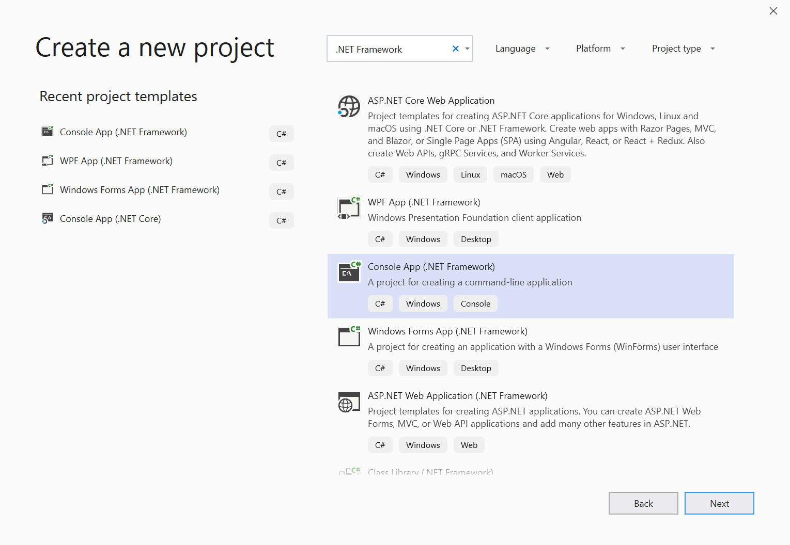
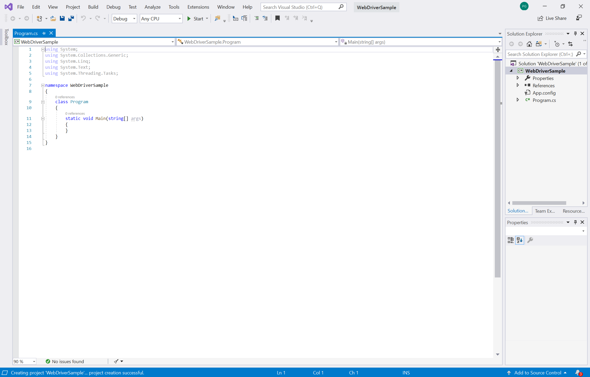
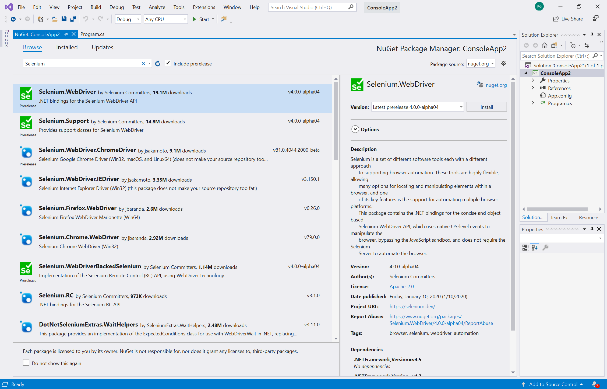

# <span data-ttu-id="11e57-104">Automatisation et test de WebView2 avec le pilote Microsoft Edge</span><span class="sxs-lookup"><span data-stu-id="11e57-104">Automating and Testing WebView2 with Microsoft Edge Driver</span></span>

<span data-ttu-id="11e57-105">Dans la mesure où WebView2 utilise la plateforme Web de chrome, les développeurs WebView2 peuvent tirer parti d’outils Web standard pour le débogage et l’automatisation.</span><span class="sxs-lookup"><span data-stu-id="11e57-105">Because WebView2 utilizes the Chromium web platform, WebView2 developers can take advantage of standard web tooling for debugging and automation.</span></span> <span data-ttu-id="11e57-106">L’un de ces outils est le sélénium, qui implémente l’API [WebDriver](https://www.w3.org/TR/webdriver2/) W3C, qui peut être utilisée pour créer des tests automatisés qui simulent les interactions utilisateur.</span><span class="sxs-lookup"><span data-stu-id="11e57-106">One such tool is Selenium, which implements the W3C [WebDriver](https://www.w3.org/TR/webdriver2/) API, which can be used to create automated tests that simulate user interactions.</span></span>

<span data-ttu-id="11e57-107">Voici comment faire:</span><span class="sxs-lookup"><span data-stu-id="11e57-107">Here's how to get started:</span></span>

## <span data-ttu-id="11e57-108">Étape 1: Télécharger l’exemple WebView2API</span><span class="sxs-lookup"><span data-stu-id="11e57-108">Step 1: Download WebView2API Sample</span></span>

<span data-ttu-id="11e57-109">Si vous n’avez pas de projet WebView2 existant, téléchargez notre [exemple d’application WebView2API](https://github.com/MicrosoftEdge/WebView2Samples/tree/master/WebView2APISample#webview2-api-sample), un exemple complet du SDK WebView2 le plus récent.</span><span class="sxs-lookup"><span data-stu-id="11e57-109">If you do not have an existing WebView2 project, download our [WebView2API Sample application](https://github.com/MicrosoftEdge/WebView2Samples/tree/master/WebView2APISample#webview2-api-sample), a comprehensive sample of the latest WebView2 SDK.</span></span> <span data-ttu-id="11e57-110">Vérifiez que vous avez satisfait ces [conditions préalables](https://github.com/MicrosoftEdge/WebView2Samples/tree/master/WebView2APISample#prerequisites).</span><span class="sxs-lookup"><span data-stu-id="11e57-110">Please double check that you have satisfied these [prerequisites](https://github.com/MicrosoftEdge/WebView2Samples/tree/master/WebView2APISample#prerequisites).</span></span>

<span data-ttu-id="11e57-111">Une fois que vous avez cloné le référentiel samples, générez le projet dans Visual Studio.</span><span class="sxs-lookup"><span data-stu-id="11e57-111">Once you have cloned the repo, build the project in Visual Studio.</span></span> <span data-ttu-id="11e57-112">Il doit ressembler à ce qui suit:</span><span class="sxs-lookup"><span data-stu-id="11e57-112">It should look like the following:</span></span>


## <span data-ttu-id="11e57-114">Étape 2: installer le pilote Microsoft Edge</span><span class="sxs-lookup"><span data-stu-id="11e57-114">Step 2: Install Microsoft Edge Driver</span></span>

<span data-ttu-id="11e57-115">Suivez les instructions pour installer le [pilote Microsoft Edge](https://docs.microsoft.com/microsoft-edge/webdriver-chromium#download-microsoft-edge-driver) le pilote spécifique au navigateur requis par sélénium pour automatiser et tester WebView2.</span><span class="sxs-lookup"><span data-stu-id="11e57-115">Follow the instructions to install [Microsoft Edge Driver](https://docs.microsoft.com/microsoft-edge/webdriver-chromium#download-microsoft-edge-driver) the browser-specific driver required by Selenium to automate and test WebView2.</span></span>

<span data-ttu-id="11e57-116">Il est important de s’assurer que la version du pilote Microsoft Edge correspond à la version de Microsoft Edge utilisée par l’application.</span><span class="sxs-lookup"><span data-stu-id="11e57-116">It is important to make sure that the version of Microsoft Edge Driver matches the version of Microsoft Edge that the application uses.</span></span> <span data-ttu-id="11e57-117">Pour que l’exemple WebView2API fonctionne, assurez-vous que votre version de Microsoft Edge est supérieure ou égale à la version prise en charge de notre dernière version du SDK trouvée [dans nos notes de publication](https://docs.microsoft.com/microsoft-edge/hosting/webview2/releasenotes).</span><span class="sxs-lookup"><span data-stu-id="11e57-117">For the WebView2API Sample to work, make sure that your version of Microsoft Edge is greater than or equal to the supported version of our latest SDK release found [in our Release Notes](https://docs.microsoft.com/microsoft-edge/hosting/webview2/releasenotes).</span></span> <span data-ttu-id="11e57-118">Pour savoir quelle version de Microsoft Edge vous utilisez actuellement, chargez `edge://settings/help` dans le navigateur.</span><span class="sxs-lookup"><span data-stu-id="11e57-118">To find out what version of Microsoft Edge you currently have, load `edge://settings/help` in the browser.</span></span>

## <span data-ttu-id="11e57-119">Étape 3: ajouter du sélénium à l’exemple WebView2API</span><span class="sxs-lookup"><span data-stu-id="11e57-119">Step 3: Add Selenium to the WebView2API Sample</span></span>

<span data-ttu-id="11e57-120">À ce stade, vous devez avoir installé Microsoft Edge, créé un projet WebView2 et installé le pilote Microsoft Edge.</span><span class="sxs-lookup"><span data-stu-id="11e57-120">At this point you should have Microsoft Edge installed, built a WebView2 project, and installed Microsoft Edge Driver.</span></span> <span data-ttu-id="11e57-121">Commençons par commencer par sélénium.</span><span class="sxs-lookup"><span data-stu-id="11e57-121">Now, let's get started using Selenium.</span></span>

> [!NOTE]
> <span data-ttu-id="11e57-122">Sélénium prend en charge C#, Java, Python, JavaScript et Ruby.</span><span class="sxs-lookup"><span data-stu-id="11e57-122">Selenium supports C#, Java, Python, Javascript, and Ruby.</span></span> <span data-ttu-id="11e57-123">Ce guide sera toutefois en C#.</span><span class="sxs-lookup"><span data-stu-id="11e57-123">However, this guide will be in C#.</span></span>

1. <span data-ttu-id="11e57-124">Commencez par créer un projet **.NET Framework C#** dans **Visual Studio**.</span><span class="sxs-lookup"><span data-stu-id="11e57-124">Start by creating a new **C# .NET Framework** project in **Visual Studio**.</span></span> <span data-ttu-id="11e57-125">Dans le coin inférieur droit, cliquez sur **suivant** pour continuer.</span><span class="sxs-lookup"><span data-stu-id="11e57-125">Click **Next** on the bottom right-hand corner to continue.</span></span>



2. <span data-ttu-id="11e57-127">Donnez un **nom**à votre projet, enregistrez-le dans votre **emplacement**préféré, puis cliquez sur **créer**.</span><span class="sxs-lookup"><span data-stu-id="11e57-127">Give your project a **name**, save it to your preferred **location**, and click **Create**.</span></span>


3. <span data-ttu-id="11e57-129">Un nouveau projet est créé.</span><span class="sxs-lookup"><span data-stu-id="11e57-129">A new project will be created.</span></span> <span data-ttu-id="11e57-130">Ce guide présente l’intégralité du code dans le fichier **Program.cs** .</span><span class="sxs-lookup"><span data-stu-id="11e57-130">In this guide, all code will be written in the **Program.cs** file.</span></span>



4. <span data-ttu-id="11e57-132">Nous allons maintenant ajouter **sélénium** au projet.</span><span class="sxs-lookup"><span data-stu-id="11e57-132">Now let's add **Selenium** to the project.</span></span> <span data-ttu-id="11e57-133">Vous pouvez installer le sélénium via le **package NuGet. WebDriver de sélénium**.</span><span class="sxs-lookup"><span data-stu-id="11e57-133">You can install Selenium via the **Selenium.WebDriver NuGet package**.</span></span>

<span data-ttu-id="11e57-134">Pour télécharger le **package NuGet. WebDriver du sélénium**, dans **Visual Studio**, survolez le **projet** , puis sélectionnez **Manage NuGet package**.</span><span class="sxs-lookup"><span data-stu-id="11e57-134">To download the **Selenium.WebDriver NuGet package**, in **Visual Studio**, hover over **Project** and select **Manage NuGet Package**.</span></span> <span data-ttu-id="11e57-135">L’écran suivant doit s’afficher:</span><span class="sxs-lookup"><span data-stu-id="11e57-135">The following screen should appear:</span></span>


5. <span data-ttu-id="11e57-137">Entrez **sélénium. WebDriver** dans la barre de recherche, cliquez sur **sélénium. WebDriver** à partir des résultats, et veillez à activer la case à cocher en regard de **inclure la version préliminaire**.</span><span class="sxs-lookup"><span data-stu-id="11e57-137">Enter **Selenium.WebDriver** in the search bar, click **Selenium.WebDriver** from the results, and make sure to checkmark the box next to **include pre-release**.</span></span> <span data-ttu-id="11e57-138">Dans la fenêtre de droite, assurez-vous que la **version** est définie pour **Installer 4.0.0-alpha04** ou version ultérieure, puis cliquez sur **installer**.</span><span class="sxs-lookup"><span data-stu-id="11e57-138">On the right-hand side window, ensure the **Version** is set to **install 4.0.0-alpha04** or later and click **Install**.</span></span> <span data-ttu-id="11e57-139">NuGet télécharge sélénium sur votre ordinateur.</span><span class="sxs-lookup"><span data-stu-id="11e57-139">Nuget will download Selenium to your machine.</span></span>

[<span data-ttu-id="11e57-140">En savoir plus sur le package NuGet. WebDriver de sélénium.</span><span class="sxs-lookup"><span data-stu-id="11e57-140">Learn more about the Selenium.WebDriver NuGet package.</span></span>](https://www.nuget.org/packages/Selenium.WebDriver/4.0.0-alpha04)



6. <span data-ttu-id="11e57-142">Pour utiliser **OpenQA. sélénium. Edge** , ajoutez l’instruction suivante: ```using OpenQA.Selenium.Edge;``` au début de **Program.cs**</span><span class="sxs-lookup"><span data-stu-id="11e57-142">Use **OpenQA.Selenium.Edge** by adding the following statement:```using OpenQA.Selenium.Edge;``` at the beginning of **Program.cs**</span></span>

```csharp
using OpenQA.Selenium.Edge;

using System;
using System.Collections.Generic;
using System.Linq;
using System.Text;
using System.Threading.Tasks;
```

## <span data-ttu-id="11e57-143">Étape 4: piloter WebView2 avec sélénium et Microsoft EdgeDriver</span><span class="sxs-lookup"><span data-stu-id="11e57-143">Step 4: Drive WebView2 with Selenium and Microsoft EdgeDriver</span></span>

1. <span data-ttu-id="11e57-144">Tout d’abord, créez l' `EdgeOptions` objet en copiant le code ci-dessous:</span><span class="sxs-lookup"><span data-stu-id="11e57-144">First, create the `EdgeOptions` object, by copying the code below:</span></span>

```csharp
static void Main(string[] args)
{
    // EdgeOptions() requires using OpenQA.Selenium.Edge
    // Construct EdgeOptions with is_legacy = false and the string "webview2"
    EdgeOptions edgeOptions = new EdgeOptions(false, "webview2");
```

<span data-ttu-id="11e57-145">L' `EdgeOptions` objet utilise deux paramètres:</span><span class="sxs-lookup"><span data-stu-id="11e57-145">The `EdgeOptions` object takes in two parameters:</span></span>
\
    **<span data-ttu-id="11e57-146">Paramètres</span><span class="sxs-lookup"><span data-stu-id="11e57-146">Parameters:</span></span>**
    1. `is_legacy`<span data-ttu-id="11e57-147">: défini sur `false` , qui indique au sélénium que vous dirigez le nouveau navigateur Microsoft Edge basé sur le chrome.</span><span class="sxs-lookup"><span data-stu-id="11e57-147">: set to `false`, which tells Selenium that you are driving the new Chromium-based Microsoft Edge browser.</span></span>
    2. `"webview2"`<span data-ttu-id="11e57-148">: chaîne indiquant au sélénium que vous entrainez **WebView2**</span><span class="sxs-lookup"><span data-stu-id="11e57-148">: a string that tell Selenium you are driving **WebView2**</span></span>

2. <span data-ttu-id="11e57-149">Ensuite, définissez `edgeOptions.BinaryLocation` le chemin d’accès du fichier exécutable de votre projet WebView2, créez une chaîne appelée `msedgedriverDir` qui fournit le chemin d’accès du fichier à l’endroit où vous avez installé le [pilote Microsoft Edge](https://developer.microsoft.com/microsoft-edge/tools/webdriver/#downloads), puis créez une chaîne appelée `msedgedriverExe` pour stocker le nom du fichier exécutable du pilote Microsoft Edge.</span><span class="sxs-lookup"><span data-stu-id="11e57-149">Next, set `edgeOptions.BinaryLocation` to the file path of your WebView2 project's executable, create a string called `msedgedriverDir` that provides the file path to where you installed [Microsoft Edge Driver](https://developer.microsoft.com/microsoft-edge/tools/webdriver/#downloads), and create a string called `msedgedriverExe` to store the name of the Microsoft Edge Driver executable.</span></span> <span data-ttu-id="11e57-150">Par défaut, l’exécutable est appelé `"msedgedriver.exe"` .</span><span class="sxs-lookup"><span data-stu-id="11e57-150">By default, the executable is called `"msedgedriver.exe"`.</span></span> <span data-ttu-id="11e57-151">Utilisez ces deux chaînes pour créer l' `EdgeDriverService` objet, comme illustré ci-dessous.</span><span class="sxs-lookup"><span data-stu-id="11e57-151">Use these two strings to construct the `EdgeDriverService` object as shown below.</span></span> <span data-ttu-id="11e57-152">Enfin, créez l' `EdgeDriver` objet à l’aide `EdgeDriverService` de et `EdgeOptions` .</span><span class="sxs-lookup"><span data-stu-id="11e57-152">Finally, create the `EdgeDriver` object using `EdgeDriverService` and `EdgeOptions`.</span></span>

<span data-ttu-id="11e57-153">Vous pouvez copier et coller le code suivant `edgeOptions` .</span><span class="sxs-lookup"><span data-stu-id="11e57-153">You can copy and paste the following code underneath `edgeOptions`.</span></span> <span data-ttu-id="11e57-154">Veillez à spécifier les chemins d’accès appropriés au fichier exécutable de votre projet et au fichier exécutable du pilote Microsoft Edge sur votre ordinateur.</span><span class="sxs-lookup"><span data-stu-id="11e57-154">Make sure to specify the correct file paths to your project's executable and the Microsoft Edge Driver's executable on your machine.</span></span>

```csharp
    //Set the BinaryLocation to the filepath of the WebView2API Sample's executable
    edgeOptions.BinaryLocation = @"C:\path\to\your\webview2\project.exe";

    //Set msedgedriverDir to the filepath of the directory housing msedgedriver.exe
    string msedgedriverDir = @"C:\path\to\your\msededriver.exe's\directory";

    //Set msedgedriverExe to the name of the Edge Driver. By default it is:
    string msedgedriverExe = @"msedgedriver.exe";

    // Construct EdgeDriverService with is_legacy = false  
    EdgeDriverService service = EdgeDriverService.CreateDefaultService(msedgedriverDir, msedgedriverExe, false);

    EdgeDriver e = new EdgeDriver(service, edgeOptions);
```

3. <span data-ttu-id="11e57-155">À présent, **EdgeDriver** est configuré pour piloter **WebView2** dans votre projet.</span><span class="sxs-lookup"><span data-stu-id="11e57-155">Now, **EdgeDriver** is configured to drive the **WebView2** in your project.</span></span> <span data-ttu-id="11e57-156">Par exemple, si vous utilisez l' **exemple WebView2API**, vous pouvez **accéder** à à l’aide d’un <https://microsoft.com> appel ```e.Url = @"https://www.microsoft.com";``` .</span><span class="sxs-lookup"><span data-stu-id="11e57-156">For example, if you are using the **WebView2API Sample**, you can **Navigate** to <https://microsoft.com> by calling ```e.Url = @"https://www.microsoft.com";```.</span></span> <span data-ttu-id="11e57-157">Vous **pouvez regarder le** pilote d' **WebView2** en définissant un point d’arrêt sur cette ligne et en exécutant le projet.</span><span class="sxs-lookup"><span data-stu-id="11e57-157">You can watch **Selenium** drive **WebView2** by setting a breakpoint on this line and running the project.</span></span>

```csharp
    //The following will Navigate the WebView2API Sample from bing.com to microsoft.com
    e.Url = @"https://www.microsoft.com";

    //This exits the edge driver
    e.Quit();
}
```


<span data-ttu-id="11e57-159">Félicitations!</span><span class="sxs-lookup"><span data-stu-id="11e57-159">Congratulations!</span></span> <span data-ttu-id="11e57-160">Vous avez correctement automatisé un projet WebView2 et WebView2 piloté par le biais du pilote sélénium et Microsoft Edge.</span><span class="sxs-lookup"><span data-stu-id="11e57-160">You have successfully automated a WebView2 project and driven WebView2 using Selenium and Microsoft Edge Driver.</span></span>

## <span data-ttu-id="11e57-161">Étapes suivantes</span><span class="sxs-lookup"><span data-stu-id="11e57-161">Next Steps</span></span>

<span data-ttu-id="11e57-162">Pour en savoir plus:</span><span class="sxs-lookup"><span data-stu-id="11e57-162">To learn more:</span></span>

- <span data-ttu-id="11e57-163">Consultez la [documentation du sélénium](https://www.selenium.dev/documentation/en/webdriver/) pour obtenir un aperçu complet des API de sélénium disponibles pour le pilotage de WebView2 ou de Microsoft Edge (chrome)</span><span class="sxs-lookup"><span data-stu-id="11e57-163">Check out [Selenium's documentation](https://www.selenium.dev/documentation/en/webdriver/) for a comprehensive look at the APIs Selenium has available for driving WebView2 or Microsoft Edge (Chromium)</span></span>
- <span data-ttu-id="11e57-164">En savoir plus sur le contrôle [WebView2](https://docs.microsoft.com/microsoft-edge/hosting/webview2) et son utilisation lors de l’incorporation de contenu Web dans votre application native</span><span class="sxs-lookup"><span data-stu-id="11e57-164">Learn more about [WebView2](https://docs.microsoft.com/microsoft-edge/hosting/webview2) control and how to use it when embedding web content in your native app</span></span>
- <span data-ttu-id="11e57-165">Pour en savoir plus sur l’automatisation de Microsoft Edge (chrome), consultez [la documentation relative au pilote Microsoft Edge](https://docs.microsoft.com/microsoft-edge/webdriver-chromium) .</span><span class="sxs-lookup"><span data-stu-id="11e57-165">Check out [documentation for Microsoft Edge Driver](https://docs.microsoft.com/microsoft-edge/webdriver-chromium) to learn more about automating Microsoft Edge (Chromium)</span></span>

## <span data-ttu-id="11e57-166">Contacter l’équipe WebView2</span><span class="sxs-lookup"><span data-stu-id="11e57-166">Getting in touch with the WebView2 team</span></span>  

<span data-ttu-id="11e57-167">Aidez-nous à créer une expérience WebView2 plus riche en partageant vos commentaires!</span><span class="sxs-lookup"><span data-stu-id="11e57-167">Help us build a richer WebView2 experience by sharing your feedback!</span></span> <span data-ttu-id="11e57-168">Consultez notre page de [Commentaires référentiel Samples](https://github.com/MicrosoftEdge/WebViewFeedback) pour envoyer des demandes de fonctionnalité ou des rapports de bogues, ou pour rechercher des problèmes connus.</span><span class="sxs-lookup"><span data-stu-id="11e57-168">Visit our [feedback repo](https://github.com/MicrosoftEdge/WebViewFeedback) to submit feature requests or bug reports or to search for known issues.</span></span>
